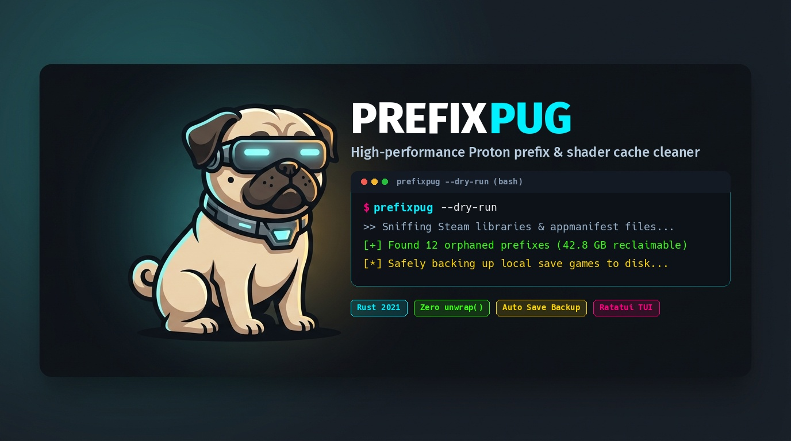

# PrefixPug

<div align="center">



**A safe Steam/Proton `compatdata` and shader cache cleaner written in Rust.**

[](https://www.rust-lang.org/)
[](LICENSE)
[](SAFETY.md)
[](https://github.com/Bvaughan7/prefixpug/actions)
[](https://github.com/Bvaughan7/prefixpug/releases)
[](https://bvaughan7.github.io/prefixpug/)

[Website](https://bvaughan7.github.io/prefixpug/) •
[The Safety Model](#why-prefixpug-the-safety-model) •
[Interactive TUI](#interactive-tui) •
[CLI & Audit Mode](#cli-commands--scripting) •
[Steam Deck](#steam-deck--decky-loader) •
[Installation](#installation) •
[Testing](#testing--safe-sandbox) •
[Full Safety Spec (SAFETY.md)](SAFETY.md)

</div>

---

## Why PrefixPug? (The Safety Model)

When you uninstall a Steam game on Linux, Valve's client leaves behind its Proton Wine prefix (`compatdata`) and compiled graphics pipelines (`shadercache`). Over time, this accumulates single-digit to low-double-digit gigabytes of abandoned files.

Writing a naive script to delete `compatdata/` folders with no matching `appmanifest_*.acf` is easy. What is difficult—and where naive cleaners cause catastrophic data loss—is handling real-world edge cases.

| Scenario | Naive Shell Script (`rm -rf`) | PrefixPug |
|:---|:---|:---|
| **Disconnected Secondary Drive** | Misclassifies games as orphans and deletes live prefixes | Verifies all configured libraries and halts immediately (Exit Code 2) |
| **Non-Steam Shortcuts (Battle.net, Heroic, emulators)** | Destroys custom prefixes (no `appmanifest`) | Ingests binary `shortcuts.vdf` across all user profiles to protect them |
| **Local Saves (`.json`, `.xml`, extensionless)** | Silent permanent data loss | Whole-root save vaulting to SHA-256 fsynced archive before removal |
| **Steam Running Concurrently** | Deletes files during game writes or downloads | Detects active Steam processes and aborts safely |
| **Wine Symlinks** | Risks unlinking target directories in `$HOME` | Strict path traversal jail; never unlinks through symlinks |

### Core Defenses
1. **Multi-Library Mount Guard:** If a secondary NVMe or external SSD configured in `libraryfolders.vdf` is unmounted, PrefixPug aborts immediately rather than misclassifying games on that drive as orphans.
2. **Non-Steam Shortcut Parser:** Ingests Steam's binary `shortcuts.vdf` across all user profiles, computing 32-bit CRC IDs and protecting custom prefixes.
3. **Blocklist Save Engine:** Inverts traditional extension allowlists. Archives entire user directories (`Saved Games`, `Documents`, `AppData`) minus crash dumps and browser caches, preserving extensionless and `.json` saves.
4. **Cryptographic Verification & fsync:** Every save archive is compressed, audited with per-file SHA-256 checksums in `manifest.json`, and flushed with `fsync` before any prefix directory is unlinked.
5. **Infrastructure Deny-List:** Critical Steam runtimes (Steam Linux Runtime, Proton Experimental, Proton Hotfix, EAC, and BattlEye) are permanently locked from cleanup.

Read the full technical specification in [**`SAFETY.md`**](SAFETY.md).

---

## Interactive TUI

PrefixPug includes an interactive terminal dashboard built with `ratatui`:

<div align="center">


</div>

### Controls & Keybindings

| Key | Action | Description |
|:---|:---|:---|
| `↑` / `k` | **Navigate Up** | Move cursor up through the prefix list |
| `↓` / `j` | **Navigate Down** | Move cursor down through the list |
| `Space` | **Toggle Selection** | Select or deselect highlighted prefix `[■]` |
| `a` | **Select All** | Batch select or deselect all visible deletable prefixes |
| `i` | **Invert Selection** | Flip selection across visible prefixes |
| `s` | **Cycle Sort Mode** | Sort by Size (descending), Age (oldest first), or AppID |
| `/` | **Search / Filter** | Filter by AppID or game title |
| `c` | **Clean Selected** | Open the confirmation modal to vault saves and purge |
| `?` / `h` | **Help Dialog** | Toggle control help dialog |
| `q` / `Esc` | **Quit** | Close modal or exit application |

---

## CLI Commands & Scripting

PrefixPug is safe-by-default: destructive CLI operations run in **dry-run mode** unless explicitly confirmed.

```bash
# Launch interactive TUI dashboard (default)
prefixpug

# Read-only audit of ALL prefixes (installed, non-Steam shortcuts, runtimes, orphans)
prefixpug audit

# Filter installed games with prefixes untouched for over 90 days
prefixpug audit --stale

# Fast terminal scan of orphaned prefixes
prefixpug scan

# Structured JSON output for scripting and monitoring
prefixpug scan --json

# Safe simulation (safe default - no files modified)
prefixpug clean

# Execute non-interactive cleanup (requires --yes or --purge)
prefixpug clean --yes

# Clean only prefixes untouched for over 60 days
prefixpug clean --older-than 60 --yes

# Low-risk mode: Clean only shader caches without touching compatdata prefixes
prefixpug shaders --yes

# Archive save files for a specific game/prefix without deleting anything
prefixpug vault 2141910

# List all archived save vaults
prefixpug backups

# Cryptographically verify a save vault against its SHA-256 manifest
prefixpug verify-backup <BACKUP_ID>

# Restore save files from an archive
prefixpug restore <BACKUP_ID> --target ~/RestoredSaves/
```

---

## Steam Deck & Decky Loader

PrefixPug includes a native SteamOS [Decky Loader plugin](decky-plugin/) with a React/TypeScript Quick Access Menu (QAM) interface and an asynchronous Python RPC bridge. It enables one-tap prefix scanning, save vaulting, and shader cache cleanup directly inside Steam Game Mode.

---

## Installation

### From Source
```bash
git clone https://github.com/Bvaughan7/prefixpug.git
cd prefixpug
./install.sh
```
The installer compiles the binary with Link-Time Optimization (`lto = true`) and installs it to `~/.local/bin/prefixpug` alongside shell autocompletions (bash, fish, zsh) and manual pages.

### Standalone Static Binaries
Download precompiled, statically linked binaries from [GitHub Releases](https://github.com/Bvaughan7/prefixpug/releases/latest):
- `prefixpug-x86_64-unknown-linux-musl.tar.gz` (Zero external dependencies)
- `prefixpug-x86_64-unknown-linux-gnu.tar.gz`

---

## Testing & Safe Sandbox

PrefixPug includes an end-to-end mock Steam sandbox generator to safely verify orphan detection, non-Steam shortcut protection, and save file restoration:

```bash
# 1. Generate an isolated sandbox in /tmp
./tests/test_sandbox.sh

# 2. Run scan against the mock sandbox
prefixpug --library-vdf /tmp/prefixpug_mock_steam/steamapps/libraryfolders.vdf scan

# 3. Launch the interactive TUI against the mock sandbox
prefixpug --library-vdf /tmp/prefixpug_mock_steam/steamapps/libraryfolders.vdf

# 4. Run the full cargo test suite
cargo test
```

---

## Transparency & License

- **AI Disclosure:** Developed with AI assistance; all logic, safety boundaries, and edge cases are verified by comprehensive unit and integration tests (see `tests/` and `SAFETY.md`).
- **License:** Licensed under the [MIT License](LICENSE). Copyright (c) 2026 Bryan Vaughan.
