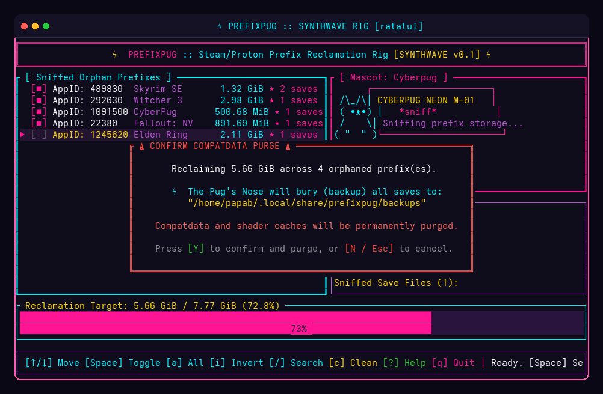

# ⚡ PrefixPug

<div align="center">


**High-performance Rust utility to sniff out and safely reclaim orphaned Steam/Proton `compatdata` and shader caches.**

[](https://www.rust-lang.org/)
[](LICENSE)
[](https://github.com/Bvaughan7/prefixpug/actions/workflows/ci.yml)
[](https://github.com/Bvaughan7/prefixpug/releases/latest)

[Overview](#-overview) •
[Demo & Aesthetics](#-cyberpunk-synthwave-tui) •
[Safety & The Pug's Nose](#-the-pugs-nose-save-vault) •
[Installation](#-quick-install) •
[CLI Usage](#-cli-commands--automation) •
[Testing](#-testing--safe-sandbox)

</div>

---

## 🐾 Overview

When Steam games are uninstalled on Linux, Valve's Steam client frequently leaves behind gigabytes of Wine/Proton compatibility prefixes (`compatdata`) and compiled graphics pipelines (`shadercache`). 

**PrefixPug** is a high-performance terminal tool written in safe Rust designed to sniff out these abandoned folders and reclaim NVMe/SSD storage. Prioritizing user safety above all else, PrefixPug automatically excavates and vaults local game saves before any deletion commands are executed.

---

## 🎨 Cyberpunk Synthwave TUI

PrefixPug features an interactive terminal dashboard built with `ratatui` adhering to a high-contrast Neon Cyan & Neon Pink Synthwave aesthetic:

<div align="center">


</div>

### 🎛 TUI Features & Keybindings

| Keybinding | Action | Description |
| :--- | :--- | :--- |
| `↑` / `k` | **Navigate Up** | Move cursor up through the orphaned prefixes list |
| `↓` / `j` | **Navigate Down** | Move cursor down through the list |
| `Space` | **Toggle Selection** | Select or deselect the highlighted prefix `[■]` |
| `a` | **Select All** | Batch select or deselect all visible prefixes |
| `i` | **Invert Selection** | Flip selection status across all listed entries |
| `/` | **Search / Filter** | Real-time interactive search by AppID or game title |
| `c` | **Clean Selected** | Opens the safety confirmation modal to purge and reclaim space |
| `?` / `h` | **Control Matrix** | Toggle interactive help modal |
| `q` / `Esc` | **Quit / Cancel** | Close modals or gracefully exit the application |

---

## 🛡 The Pug's Nose (Save Vault)

> [!IMPORTANT]
> **Zero Unsafe Deletions:** PrefixPug strictly enforces confirmation prompts and never panics. All operations return structured `Result` types.

<div align="center">



</div>

Before any directory is deleted, **The Pug's Nose** heuristic engine sniffs deep into the Wine prefix structure for game saves:
- **Standard Windows Save Roots:**
  - `%USERPROFILE%/Saved Games/*`
  - `%USERPROFILE%/Documents/My Games/*`
  - `%APPDATA%` (`AppData/Roaming/*`)
  - `%LOCALAPPDATA%` (`AppData/Local/*` and `AppData/LocalLow/*`)
- **Game Save Heuristics:** Automatically detects `.sav`, `.save`, `.ess`, `.fos`, `.skse`, `.dat`, `.sqlite`, `.db` files while ignoring temporary crash dumps and log blobs.
- **Compressed Vaulting:** Selected saves are bundled into compressed `saves.tar.gz` archives with a detailed `manifest.json` metadata record in `~/.local/share/prefixpug/backups/`.
- **Full Restoration:** Any backed-up save archive can be unpacked and restored with a single command:
  ```bash
  prefixpug restore <BACKUP_ID> --target ~/RestoredSaves/
  ```

---

## ⚡ Quick Install

### One-Line Local Build & Install
Clone the repository and run the automated installer:
```bash
git clone https://github.com/Bvaughan7/prefixpug.git
cd prefixpug
./install.sh
```
This will:
1. Compile the binary with full Link-Time Optimization (`lto = true`) and binary stripping.
2. Install the binary to `~/.local/bin/prefixpug`.
3. Generate and link shell autocompletions for `bash`, `zsh`, and `fish`.

### Precompiled Static Binaries
Download statically compiled standalone binaries directly from [GitHub Releases](https://github.com/Bvaughan7/prefixpug/releases/latest):
- `prefixpug-x86_64-unknown-linux-musl.tar.gz` (Fully static, zero runtime dependencies)
- `prefixpug-x86_64-unknown-linux-gnu.tar.gz`

---

## 🚀 CLI Commands & Automation

PrefixPug also runs headlessly in scripts, cron jobs, and non-interactive environments:

```bash
# Launch interactive Cyberpunk TUI dashboard (default)
prefixpug

# Fast terminal scan of orphaned prefixes
prefixpug scan

# Machine-readable JSON output (ideal for scripting and jq)
prefixpug scan --json

# Scan only specific AppIDs
prefixpug scan --appids 489830,1091500

# Safe simulation (dry run - no files touched)
prefixpug clean --dry-run

# Automated non-interactive cleanup
prefixpug clean --auto-clean

# List all archived save vaults
prefixpug backups

# Restore an archived save vault
prefixpug restore 489830_1788469211 --target ~/MySaves/

# Generate shell completions
prefixpug completions zsh > ~/.zfunc/_prefixpug
```

---

## 🧪 Testing & Safe Sandbox

PrefixPug includes a mock Steam library generator that allows you to safely test orphan detection, save file sniffing, and TUI animations without altering your real Steam files:

```bash
# 1. Build an isolated sandbox in /tmp with mock installed and orphaned games
./tests/test_sandbox.sh

# 2. Test scan against the mock sandbox
prefixpug --library-vdf /tmp/prefixpug_mock_steam/steamapps/libraryfolders.vdf scan

# 3. Launch interactive TUI against the mock sandbox
prefixpug --library-vdf /tmp/prefixpug_mock_steam/steamapps/libraryfolders.vdf

# 4. Run the full cargo test suite
cargo test
```

---

## 🏗 Directory Structure & Architecture

```
prefixpug/
├── Cargo.toml                  # Dependencies (ratatui, clap, keyvalues-parser, walkdir)
├── install.sh                  # Local installation and shell completion script
├── assets/                     # Visual banner, screenshots, and demo GIF
│   ├── hero_banner.jpg         # Neon Cyberpug synthwave banner
│   ├── prefixpug_demo.gif      # High-framerate animated TUI demo
│   ├── prefixpug_tui.png       # High-resolution TUI screenshot
│   └── prefixpug_modal.png     # Safety confirmation modal screenshot
├── src/
│   ├── lib.rs                  # Library entrypoint
│   ├── main.rs                 # CLI entrypoint, event loop & signal handlers
│   ├── cli.rs                  # Clap command definitions and flags
│   ├── scanner.rs              # Non-blocking filesystem traversal & save heuristics
│   ├── vdf_parser.rs           # ACF/VDF parser, drive mapper & title inference
│   ├── backup.rs               # Gzip vault archiving, manifest generation & restore
│   └── tui/
│       ├── mod.rs
│       ├── app.rs              # State machine, filtering & animation timers
│       └── ui.rs               # Ratatui synthwave layout & Cyberpug mascot
├── tests/
│   ├── integration_tests.rs    # End-to-end simulated Steam library tests
│   └── test_sandbox.sh         # Interactive mock sandbox testing script
└── .github/
    └── workflows/
        ├── ci.yml              # Automatic formatting, clippy, and unit tests
        └── release.yml         # Matrix static binary builds & release publishing
```

---

## 📄 License

Licensed under the [MIT License](LICENSE). Copyright (c) 2026 Bryan Vaughan.
